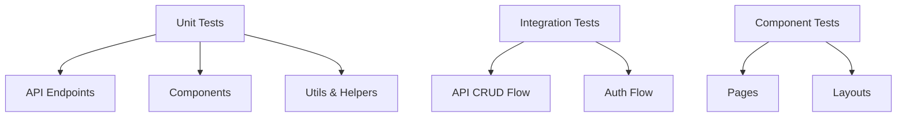
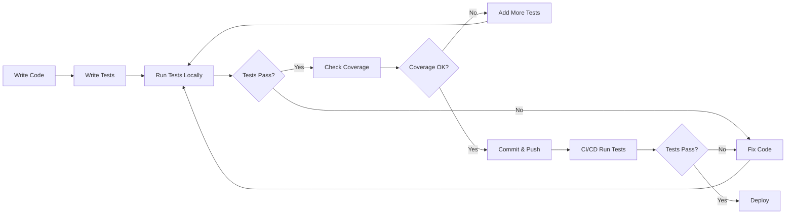

# Plan Unit Testing untuk SIMOP - Sistem Monitoring Program

**Created:** 2026-02-01  
**Target:** Nuxt 4 Application with Drizzle ORM & Better Auth  
**Testing Stack:** Vitest + @nuxt/test-utils + Playwright

---

## 📋 Executive Summary

Aplikasi SIMOP adalah sistem monitoring program berbasis Nuxt 4 yang mengelola:
- **Manajemen Program PKPT** (Create, Read, Update, Delete)
- **Manajemen Users** dengan role-based access (Admin & Operator)
- **Authentication System** menggunakan Better Auth
- **Public API** untuk widget eksternal
- **Database Seeding & Migration** utilities

Plan ini mencakup setup dan implementasi unit testing untuk semua fitur dengan testing framework terbaru dan terbaik untuk Nuxt 4.

---

## 🎯 Testing Strategy

### Testing Layers



### Testing Tools

1. **Vitest** - Modern, fast unit testing framework untuk Vite-based projects
2. **@nuxt/test-utils** - Official Nuxt testing utilities
3. **Playwright** - E2E testing untuk user flows
4. **@vitest/coverage-v8** - Code coverage reporting
5. **@faker-js/faker** - Generate realistic test data

---

## 📦 Struktur File Testing

```
tests/
├── unit/
│   ├── server/
│   │   ├── api/
│   │   │   ├── programs/
│   │   │   │   ├── index.get.test.ts
│   │   │   │   ├── create.post.test.ts
│   │   │   │   ├── [id].get.test.ts
│   │   │   │   ├── [id].patch.test.ts
│   │   │   │   └── [id].delete.test.ts
│   │   │   ├── users/
│   │   │   │   ├── index.get.test.ts
│   │   │   │   ├── create.post.test.ts
│   │   │   │   ├── [id].patch.test.ts
│   │   │   │   └── [id].delete.test.ts
│   │   │   ├── public/
│   │   │   │   └── programs.get.test.ts
│   │   │   ├── auth/
│   │   │   │   └── session.get.test.ts
│   │   │   └── seed/
│   │   │       └── init.post.test.ts
│   │   ├── utils/
│   │   │   ├── auth.test.ts
│   │   │   └── drizzle.test.ts
│   │   └── database/
│   │       └── schema.test.ts
│   ├── components/
│   │   └── pages/
│   │       ├── admin/
│   │       │   ├── index.test.ts
│   │       │   ├── programs.test.ts
│   │       │   ├── users.test.ts
│   │       │   └── transparansi.test.ts
│   │       ├── widget/
│   │       │   └── running.test.ts
│   │       ├── index.test.ts
│   │       ├── login.test.ts
│   │       └── publik.test.ts
│   └── layouts/
│       └── admin.test.ts
├── integration/
│   ├── programs-crud.test.ts
│   ├── users-crud.test.ts
│   ├── auth-flow.test.ts
│   └── public-api.test.ts
├── e2e/
│   ├── auth.spec.ts
│   ├── admin-programs.spec.ts
│   ├── admin-users.spec.ts
│   └── widget.spec.ts
├── fixtures/
│   ├── programs.ts
│   ├── users.ts
│   └── auth.ts
└── utils/
    ├── test-db.ts
    ├── test-auth.ts
    └── test-helpers.ts
```

---

## 🔧 Detail Plan per Tahap

### 1️⃣ Setup Testing Framework

**Dependencies yang akan diinstall:**

```json
{
  "devDependencies": {
    "vitest": "^2.1.0",
    "@nuxt/test-utils": "^3.15.0",
    "@vitest/coverage-v8": "^2.1.0",
    "@vue/test-utils": "^2.5.0",
    "@faker-js/faker": "^9.3.0",
    "@playwright/test": "^1.49.0",
    "happy-dom": "^15.11.0",
    "pg-mem": "^3.0.0"
  }
}
```

**Test Commands:**

```json
{
  "scripts": {
    "test": "vitest",
    "test:unit": "vitest run --coverage",
    "test:watch": "vitest watch",
    "test:e2e": "playwright test",
    "test:all": "pnpm test:unit && pnpm test:e2e"
  }
}
```

---

### 2️⃣ Konfigurasi Testing Environment

**File: vitest.config.ts**

- Setup Nuxt test environment
- Configure test database connection
- Setup coverage thresholds (target: 80%)
- Mock external dependencies

**File: playwright.config.ts**

- Configure browser testing
- Setup test fixtures
- Configure test URLs

---

### 3️⃣ Setup Test Database

**Test Database Strategy:**

1. Use **pg-mem** untuk in-memory PostgreSQL database
2. Seeding test data sebelum setiap test suite
3. Cleanup database setelah setiap test
4. Isolated test transactions

**File: tests/utils/test-db.ts**

```typescript
// Utilities untuk:
- createTestDatabase()
- seedTestData()
- clearTestDatabase()
- createTestTransaction()
```

---

### 4️⃣ Buat Test Utilities & Helpers

**File: tests/utils/test-auth.ts**

```typescript
// Mock authentication utilities:
- createMockAdminSession()
- createMockOperatorSession(irbanUnit)
- createMockUnauthorizedSession()
- mockAuthHeaders()
```

**File: tests/fixtures/programs.ts**

```typescript
// Test data factories:
- createMockProgram()
- createMockProgramArray()
- programDataBuilder()
```

**File: tests/fixtures/users.ts**

```typescript
// Test data factories:
- createMockAdmin()
- createMockOperator()
- createMockUserArray()
```

---

### 5️⃣ Unit Test - Database Schema & Utilities

**File: tests/unit/server/database/schema.test.ts**

Test cases:
- ✅ Validasi struktur tabel [`users`](server/database/schema.ts:3)
- ✅ Validasi struktur tabel [`sessions`](server/database/schema.ts:16)
- ✅ Validasi struktur tabel [`accounts`](server/database/schema.ts:27)
- ✅ Validasi struktur tabel [`pkptPrograms`](server/database/schema.ts:52)
- ✅ Validasi relasi foreign keys
- ✅ Validasi unique constraints
- ✅ Validasi default values

**File: tests/unit/server/utils/drizzle.test.ts**

Test cases:
- ✅ Test [`useDrizzle()`](server/utils/drizzle.ts) connection
- ✅ Test database query execution
- ✅ Test error handling untuk connection failures

---

### 6️⃣ Unit Test - Authentication System

**File: tests/unit/server/utils/auth.test.ts**

Test cases:
- ✅ Validasi konfigurasi Better Auth
- ✅ Test email/password authentication
- ✅ Test session creation
- ✅ Test session validation
- ✅ Test role & irbanUnit dalam session
- ✅ Test unauthorized access handling

**File: tests/unit/server/api/auth/session.get.test.ts**

Test cases:
- ✅ Return session untuk authenticated user
- ✅ Return null untuk unauthenticated user
- ✅ Include user role dan irbanUnit di session

---

### 7️⃣ Unit Test - Programs API Endpoints

**File: tests/unit/server/api/programs/index.get.test.ts**

Test cases:
- ✅ Admin dapat melihat semua program
- ✅ Admin dapat filter program by [`irbanPj`](server/api/programs/index.get.ts:22)
- ✅ Operator hanya melihat program sesuai [`irbanUnit`](server/api/programs/index.get.ts:27) mereka
- ✅ Unauthorized user mendapat 401
- ✅ Programs terurut by [`createdAt`](server/api/programs/index.get.ts:32) DESC

**File: tests/unit/server/api/programs/create.post.test.ts**

Test cases:
- ✅ Admin dapat membuat program untuk semua irban
- ✅ Operator hanya dapat membuat program untuk irban mereka
- ✅ Auto-generate [`kodeProgram`](server/api/programs/create.post.ts:33) dengan format benar
- ✅ Sequence number increment dengan benar
- ✅ Validasi required fields ([`namaKegiatan`](server/api/programs/create.post.ts:13))
- ✅ Default [`createdById`](server/api/programs/create.post.ts:58) sesuai user login
- ✅ Unauthorized user mendapat 401

**File: tests/unit/server/api/programs/[id].get.test.ts**

Test cases:
- ✅ Return program details by ID
- ✅ Return 404 untuk ID tidak exist
- ✅ Return 401 untuk unauthorized user

**File: tests/unit/server/api/programs/[id].patch.test.ts**

Test cases:
- ✅ Admin dapat update semua program
- ✅ Operator hanya dapat update program di irban mereka
- ✅ Tidak dapat update [`kodeProgram`](server/api/programs/[id].patch.ts:35)
- ✅ Operator tidak dapat update [`isSecret`](server/api/programs/[id].patch.ts:38)
- ✅ Admin dapat update [`isSecret`](server/api/programs/[id].patch.ts:38)
- ✅ Update [`updatedAt`](server/api/programs/[id].patch.ts:45) timestamp
- ✅ Return 403 untuk unauthorized access
- ✅ Return 404 untuk ID tidak exist

**File: tests/unit/server/api/programs/[id].delete.test.ts**

Test cases:
- ✅ Admin dapat delete semua program
- ✅ Operator hanya dapat delete program di irban mereka
- ✅ Return 403 untuk unauthorized access
- ✅ Return 404 untuk ID tidak exist
- ✅ Return success message setelah delete

---

### 8️⃣ Unit Test - Users API Endpoints

**File: tests/unit/server/api/users/index.get.test.ts**

Test cases:
- ✅ Admin dapat list semua users
- ✅ Operator mendapat 403 (forbidden)
- ✅ Unauthorized user mendapat 401
- ✅ Users terurut by [`createdAt`](server/api/users/index.get.ts:22) DESC

**File: tests/unit/server/api/users/create.post.ts**

Test cases:
- ✅ Admin dapat create user baru
- ✅ Validasi required fields ([`username`](server/api/users/create.post.ts:33), [`password`](server/api/users/create.post.ts:33), [`name`](server/api/users/create.post.ts:33))
- ✅ Validasi minimum password length (6 karakter)
- ✅ Prevent duplicate [`username`](server/api/users/create.post.ts:45)
- ✅ Password di-hash dengan benar
- ✅ Create account entry untuk authentication
- ✅ Default role = 'operator'
- ✅ Operator mendapat 403 (forbidden)
- ✅ Return user data tanpa password

**File: tests/unit/server/api/users/[id].patch.test.ts**

Test cases:
- ✅ Admin dapat update user
- ✅ Update [`name`](server/api/users/[id].patch.ts:50), [`role`](server/api/users/[id].patch.ts:51), [`irbanUnit`](server/api/users/[id].patch.ts:52)
- ✅ Prevent demote admin terakhir
- ✅ Operator mendapat 403 (forbidden)
- ✅ Return 404 untuk ID tidak exist
- ✅ Update [`updatedAt`](server/api/users/[id].patch.ts:53) timestamp

**File: tests/unit/server/api/users/[id].delete.test.ts**

Test cases:
- ✅ Admin dapat delete user
- ✅ Operator mendapat 403 (forbidden)
- ✅ Return 404 untuk ID tidak exist
- ✅ Return success message setelah delete

---

### 9️⃣ Unit Test - Public API Endpoints

**File: tests/unit/server/api/public/programs.get.test.ts**

Test cases:
- ✅ Return hanya program dengan [`isPublished`](server/api/public/programs.get.ts:12) = true
- ✅ Exclude program dengan [`isSecret`](server/api/public/programs.get.ts:13) = true
- ✅ No authentication required
- ✅ Programs terurut by [`createdAt`](server/api/public/programs.get.ts:15) DESC

---

### 🔟 Unit Test - Migration & Seeding Endpoints

**File: tests/unit/server/api/seed/init.post.test.ts**

Test cases:
- ✅ Create admin user dengan proper auth
- ✅ Create 4 operator users dengan proper auth
- ✅ Create 30 sample programs
- ✅ Handle existing data (tidak duplicate)
- ✅ Return proper credentials
- ✅ Return error details jika ada failure

**File: tests/unit/server/api/migrate.get.test.ts**

Test cases:
- ✅ Run migrations successfully
- ✅ Return migration status

**File: tests/unit/server/api/migration-status.get.test.ts**

Test cases:
- ✅ Return list of applied migrations
- ✅ Return list of pending migrations

---

### 1️⃣1️⃣ Integration Test - Programs CRUD

**File: tests/integration/programs-crud.test.ts**

Test scenarios:
- ✅ Complete flow: Admin create program → update → delete
- ✅ Complete flow: Operator create program → update → delete (own irban)
- ✅ Operator tidak bisa edit program dari irban lain
- ✅ Auto-increment [`kodeProgram`](server/api/programs/create.post.ts:51) bekerja dengan benar
- ✅ Filter by irban bekerja dengan benar
- ✅ Public API tidak show secret programs

---

### 1️⃣2️⃣ Integration Test - Users CRUD

**File: tests/integration/users-crud.test.ts**

Test scenarios:
- ✅ Complete flow: Admin create user → update → delete
- ✅ Operator tidak bisa access users endpoints
- ✅ Password hashing dan authentication bekerja
- ✅ Cannot demote last admin

---

### 1️⃣3️⃣ Unit Test - Vue Components

**File: tests/unit/components/pages/admin/programs.test.ts**

Test cases:
- ✅ Render program list correctly
- ✅ Filter by irban works
- ✅ Create program modal works
- ✅ Edit program modal works
- ✅ Delete program confirmation works

**File: tests/unit/components/pages/admin/users.test.ts**

Test cases:
- ✅ Render user list correctly
- ✅ Create user modal works
- ✅ Edit user modal works
- ✅ Delete user confirmation works

**File: tests/unit/components/pages/widget/running.test.ts**

Test cases:
- ✅ Fetch public programs
- ✅ Filter hanya status = 'pelaksanaan'
- ✅ Display progress bar correctly
- ✅ Handle empty state

**File: tests/unit/components/pages/login.test.ts**

Test cases:
- ✅ Render login form
- ✅ Form validation works
- ✅ Submit login credentials
- ✅ Redirect after successful login

**File: tests/unit/layouts/admin.test.ts**

Test cases:
- ✅ Render admin layout
- ✅ Show navigation menu
- ✅ Show user info
- ✅ Logout button works

---

### 1️⃣4️⃣ Setup Test Coverage Reporting

**Coverage Targets:**

- **Overall:** 80%
- **API Endpoints:** 90%
- **Utils:** 85%
- **Components:** 75%

**Coverage Configuration:**

```typescript
// vitest.config.ts
coverage: {
  provider: 'v8',
  reporter: ['text', 'json', 'html'],
  exclude: [
    'node_modules/',
    'tests/',
    '.nuxt/',
    '*.config.ts',
    'migrations/'
  ],
  thresholds: {
    lines: 80,
    functions: 80,
    branches: 80,
    statements: 80
  }
}
```

**Coverage Reports:**

- HTML report: `coverage/index.html`
- JSON report: `coverage/coverage-final.json`
- Console summary setelah test run

---

### 1️⃣5️⃣ Dokumentasi Testing

**File: tests/README.md**

Dokumentasi berisi:
- Overview testing strategy
- Setup instructions
- Cara run tests
- Cara debug tests
- Best practices
- Troubleshooting

**File: TESTING.md** (root)

Quick guide berisi:
- Commands untuk run tests
- CI/CD integration
- Coverage requirements
- Contributing guidelines

---

## 🎬 E2E Testing Scenarios

**File: tests/e2e/auth.spec.ts**

- ✅ User dapat login sebagai admin
- ✅ User dapat login sebagai operator
- ✅ Invalid credentials ditolak
- ✅ Session persists setelah refresh

**File: tests/e2e/admin-programs.spec.ts**

- ✅ Admin dapat create program
- ✅ Admin dapat edit program
- ✅ Admin dapat delete program
- ✅ Admin dapat filter program by irban
- ✅ Admin dapat toggle secret status

**File: tests/e2e/admin-users.spec.ts**

- ✅ Admin dapat create user
- ✅ Admin dapat edit user
- ✅ Admin dapat delete user

**File: tests/e2e/widget.spec.ts**

- ✅ Widget dapat diembed di external site
- ✅ Widget show running programs
- ✅ Widget tidak show secret programs

---

## 📊 Testing Metrics

**Target Testing Metrics:**

| Metric | Target | Current | Status |
|--------|--------|---------|--------|
| Code Coverage | 80% | 0% | ⏳ Pending |
| API Tests | 100% | 0% | ⏳ Pending |
| Component Tests | 80% | 0% | ⏳ Pending |
| Integration Tests | 90% | 0% | ⏳ Pending |
| E2E Tests | 100% | 0% | ⏳ Pending |

---

## 🔄 Testing Workflow



---

## 📝 Best Practices

### Unit Testing

1. **Isolasi** - Setiap test harus independent
2. **AAA Pattern** - Arrange, Act, Assert
3. **Mock Dependencies** - Jangan hit real database/API
4. **Descriptive Names** - Test name harus jelas
5. **Fast Execution** - Test harus cepat (<5s untuk unit tests)

### Integration Testing

1. **Use Test Database** - Separate dari production
2. **Transaction Rollback** - Cleanup setelah test
3. **Realistic Scenarios** - Test real user flows
4. **Proper Fixtures** - Use realistic test data

### E2E Testing

1. **User Perspective** - Test dari POV user
2. **Happy & Unhappy Paths** - Test both scenarios
3. **Stable Selectors** - Use data-testid attributes
4. **Minimal Flakiness** - Avoid time-dependent tests

---

## 🚀 Implementation Order

1. ✅ Setup framework & dependencies
2. ✅ Configure test environment
3. ✅ Setup test database & utilities
4. ✅ Write API unit tests (programs & users)
5. ✅ Write integration tests (CRUD flows)
6. ✅ Write component tests
7. ✅ Write E2E tests
8. ✅ Setup coverage reporting
9. ✅ Write documentation

---

## 📚 Resources

- [Vitest Documentation](https://vitest.dev/)
- [Nuxt Testing Guide](https://nuxt.com/docs/getting-started/testing)
- [Vue Test Utils](https://test-utils.vuejs.org/)
- [Playwright Documentation](https://playwright.dev/)
- [Testing Best Practices](https://kentcdodds.com/blog/common-testing-mistakes)

---

## ✅ Definition of Done

Testing implementation dianggap selesai jika:

- ✅ Semua API endpoints memiliki unit tests
- ✅ Semua critical user flows memiliki integration tests
- ✅ Code coverage mencapai minimal 80%
- ✅ E2E tests untuk main features berjalan sukses
- ✅ CI/CD pipeline menjalankan tests otomatis
- ✅ Coverage report di-generate setiap test run
- ✅ Dokumentasi testing lengkap dan up-to-date
- ✅ No failing tests di main branch

---

**Next Steps:** Setelah plan ini diapprove, saya akan switch ke mode "Code" untuk mulai mengimplementasikan testing setup dan test cases.
